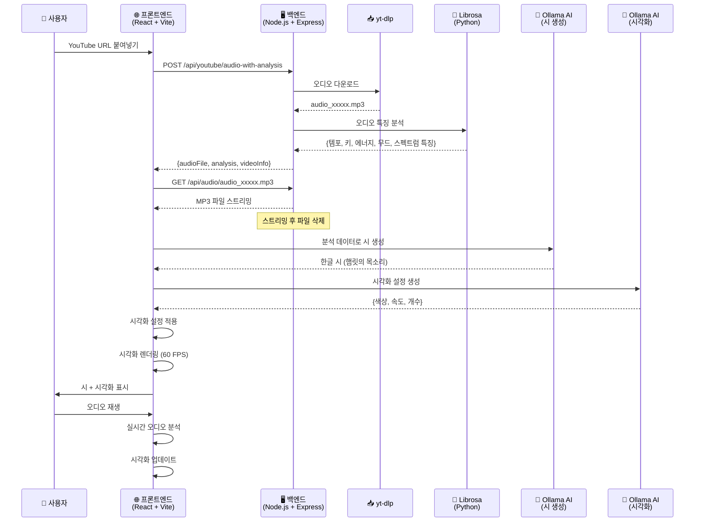
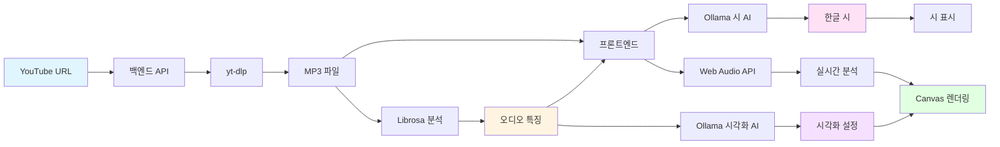

# Music Poetry Canvas

> 🎵 YouTube 음악을 AI 시와 동적 시각화로 변환
> 
> **[Kiro](https://kiro.dev)로 제작** - AI 기반 IDE로 빠른 개발

YouTube 음악을 실시간 오디오 시각화, AI 생성 한글 시(햄릿의 목소리), 동적 비주얼 효과와 결합하여 다감각적 경험으로 변환하는 몰입형 웹 애플리케이션입니다.

[English Documentation](README.md)

## ✨ 주요 기능

### 🎨 모던 UI 디자인
- **다크 테마**: 우아한 다크 차콜 그레이 그라데이션 배경
- **버건디 악센트**: 전문적인 버건디(#800020) 헤더와 푸터
- **글래스모피즘**: 백드롭 블러 효과의 반투명 유리 카드
- **shadcn/ui 컴포넌트**: 세련되고 접근성 높은 UI 컴포넌트

### 🎵 YouTube 오디오 통합
- YouTube URL을 붙여넣으면 즉시 음악 분석 및 시각화
- yt-dlp 기반의 안정적인 오디오 추출
- Python librosa를 통한 고급 오디오 특징 분석 (템포, 에너지, 무드, 스펙트럼 특징)

### 🤖 AI 생성 시
- **11가지 문학 페르소나**: 햄릿, 니체, 이상, 보들레르, 랭보, 김수영, 윤동주, 에드거 앨런 포, 오스카 와일드, 카프카, 백석 중 선택
- **7개 언어**: 한국어, 영어, 일본어, 중국어, 프랑스어, 독일어, 스페인어로 시 생성
- **이중 AI 제공자**: 로컬 Ollama 또는 클라우드 기반 OpenAI 사용
- **시 재생성**: 같은 음악에 대한 여러 해석 생성
- 음악 특성에서 영감을 받은 철학적 성찰
- 오디오 분석 기반 실시간 생성 (약 500자)

### 🎨 동적 시각화
- **AI 설정 파라미터**: 음악 분석 기반 자동 생성되는 시각화 설정
- **그라데이션 모드**: BPM 동기화 회전 그라데이션, AI 선택 색상
- **이퀄라이저 모드**: 동적 색상 구성의 실시간 주파수 바
- **스포트라이트 모드**: AI가 결정한 개수, 속도, 반경의 애니메이션 조명
- **결합 모드**: 여러 효과를 레이어로 결합
- 그라데이션 오버레이가 있는 YouTube 썸네일 배경

### ⚙️ 커스터마이징 설정
- **설정 패널**: 모든 AI 구성 옵션을 위한 중앙 집중식 UI
- **페르소나 선택**: 시를 위한 선호하는 문학적 목소리 선택
- **언어 선택**: 선호하는 언어로 시 생성
- **AI 제공자**: Ollama(로컬)와 OpenAI(클라우드) 간 전환
- **모델 선택**: 사용 가능한 Ollama 모델 중 선택
- **영구 설정**: 세션 간 환경설정 저장

### 🎭 스토리텔링 경험
- 오디오 분석 중 상황별 메시지
- 상태 간 부드러운 전환
- 사용자 상호작용을 위한 가이드 힌트
- 하이라이트가 포함된 경험 요약

### 🔧 기술적 하이라이트
- **Kiro AI IDE**로 전체 개발하여 빠른 개발 실현
- Web Audio API를 통한 실시간 오디오 분석
- fast-check를 사용한 속성 기반 테스팅
- 쉬운 확장을 위한 모듈식 아키텍처

## 🛠️ 기술 스택

### 프론트엔드
- **프레임워크**: React 18+ with TypeScript
- **빌드 도구**: Vite (빠른 HMR, 최적화된 빌드)
- **스타일링**: Tailwind CSS v4 with shadcn/ui 컴포넌트
- **UI 컴포넌트**: shadcn/ui (Button, Input, Card, Slider, Toggle 등)
- **상태 관리**: Zustand (경량)
- **오디오 처리**: Web Audio API (네이티브 브라우저 지원)
- **시각화**: HTML5 Canvas 2D API
- **테스팅**: Vitest + fast-check (100+ 반복 속성 기반 테스팅)

### 백엔드
- **런타임**: Node.js with Express
- **오디오 추출**: yt-dlp (YouTube 오디오 다운로드)
- **오디오 분석**: Python librosa (템포, 키, 에너지, 무드, 스펙트럼 특징)
- **CORS**: 로컬 개발용 구성

### AI 통합
- **로컬 AI**: Ollama (RTX 3060 호환)
  - 기본 모델: gemma3:4b
  - 엔드포인트: http://localhost:11434
  - 여러 모델 지원 (설정에서 선택 가능)
- **클라우드 AI**: OpenAI API
  - GPT-4, GPT-3.5-turbo 및 기타 모델
  - 암호화된 안전한 API 키 저장
  - 설정 패널에서 구성 가능
- **프로덕션**: AWS Bedrock (Claude 모델) - 배포 준비 완료
- **폴백**: 템플릿 기반 시 생성

### 개발 도구
- **IDE**: [Kiro](https://kiro.dev)로 제작 - AI 기반 개발 환경
- **버전 관리**: Git
- **패키지 매니저**: npm

## 🚀 시작하기

### 사전 요구사항

- **Node.js 18+** 및 npm
- **Python 3.8+** with pip (오디오 분석용)
- **yt-dlp** (YouTube 오디오 추출용)
- **Ollama** (로컬 AI 시 생성용)
  - 설치: https://ollama.com/download
  - 모델 다운로드: `ollama pull gemma3:4b`

### 설치

1. **저장소 클론**
   ```bash
   git clone <repository-url>
   cd music-poetry-canvas
   ```

2. **프론트엔드 의존성 설치**
   ```bash
   npm install
   ```

3. **백엔드 의존성 설치**
   ```bash
   cd backend
   npm install
   pip install -r requirements.txt
   ```

4. **yt-dlp 설치**
   ```bash
   # pip 사용
   pip install yt-dlp
   
   # 또는 패키지 매니저 사용
   # macOS: brew install yt-dlp
   # Windows: winget install yt-dlp
   ```

5. **환경 변수 설정**
   ```bash
   # 프론트엔드
   cp .env.example .env.development
   
   # 백엔드
   cd backend
   cp .env.example .env
   ```

6. **Ollama 시작** (아직 실행 중이 아닌 경우)
   ```bash
   ollama serve
   ```

### 애플리케이션 실행

1. **백엔드 서버 시작** (`backend/` 디렉토리에서)
   ```bash
   npm start
   ```
   백엔드는 http://localhost:3001에서 실행됩니다

2. **프론트엔드 시작** (루트 디렉토리에서)
   ```bash
   npm run dev
   ```
   프론트엔드는 http://localhost:5173에서 실행됩니다

3. **브라우저 열기** http://localhost:5173으로 이동

4. **AI 설정 구성** (선택사항)
   - 헤더의 설정 아이콘 클릭
   - 선호하는 페르소나와 언어 선택
   - AI 제공자 선택 (Ollama 또는 OpenAI)
   - OpenAI 사용 시 API 키 입력

5. **YouTube URL 붙여넣기** 후 Enter를 눌러 경험을 시작하세요!

## 🎯 작동 방식

1. **설정 구성** (선택사항): 페르소나, 언어, AI 제공자 선택
2. **YouTube URL 붙여넣기**: 아무 YouTube 음악 URL 입력
3. **오디오 분석**: 백엔드가 오디오를 다운로드하고 librosa로 분석
   - 추출: 템포, 키, 에너지, 감정가, 무드, 스펙트럼 특징
4. **AI 시 생성**: AI가 선택한 페르소나의 목소리와 언어로 시 생성
   - 음악 특성 기반 철학적 성찰
   - 설정에 따라 Ollama(로컬) 또는 OpenAI(클라우드) 사용
5. **시각화 설정**: AI가 시각화 파라미터 생성
   - 음악 무드와 에너지 기반 색상, 속도, 개수
6. **실시간 렌더링**: Web Audio API + Canvas로 60 FPS 시각화
7. **인터랙티브 경험**: 재생, 일시정지, 시각화 모드 전환, 시 재생성

## 🏗️ 시스템 아키텍처



### 데이터 흐름



## 🎨 시각화 모드

- **그라데이션**: BPM과 동기화된 회전하는 2색 그라데이션
- **이퀄라이저**: 색상 그라데이션이 있는 실시간 주파수 바
- **스포트라이트**: 배경을 가로질러 움직이는 애니메이션 조명
- **결합**: 모든 효과를 레이어로 결합

모든 파라미터(색상, 속도, 개수)는 음악의 특성에 따라 AI가 동적으로 생성합니다!

## 🔄 시 재생성

첫 번째 시가 마음에 들지 않나요? **재생성** 버튼을 클릭하여 새로운 해석을 만드세요:
- 동일한 오디오 분석 데이터 사용
- 선택한 페르소나와 언어로 새로운 시 생성
- 비교를 위한 시 히스토리 유지
- 로딩 표시기와 함께 즉시 재생성

## ⚙️ 설정

### 오디오 설정
- **최대 길이**: 5분 (300초)
- **샘플 레이트**: 44.1 kHz
- **FFT 크기**: 2048
- **목표 FPS**: 부드러운 시각화를 위한 60 FPS

### AI 설정

#### 앱 내 설정 패널
헤더의 설정 아이콘을 클릭하여 설정 패널에 접근하세요. 구성 가능:

**페르소나 선택** (기본값: 햄릿)
- 11가지 문학 페르소나 중 선택
- 각 페르소나는 고유한 목소리와 스타일 제공
- 사용 가능: 햄릿, 니체, 이상, 보들레르, 랭보, 김수영, 윤동주, 에드거 앨런 포, 오스카 와일드, 카프카, 백석

**언어 선택** (기본값: 한국어)
- 7개 언어로 시 생성
- 사용 가능: 한국어, English, 日本語, 中文, Français, Deutsch, Español

**AI 제공자 선택**
- **Ollama (로컬)**: 무료, 프라이빗, 로컬 설정 필요
- **OpenAI (클라우드)**: API 키 필요, 로컬 리소스 불필요

#### Ollama (로컬 개발)
```env
AI_PROVIDER=ollama
OLLAMA_ENDPOINT=http://localhost:11434
OLLAMA_MODEL=gemma3:4b
```
- **요구사항**: RTX 3060 이상, 12GB+ VRAM
- **모델 선택**: 설정에서 설치된 모델 중 선택
- **시 길이**: 약 500자
- **Temperature**: 창의적 출력을 위한 0.7
- **설정**: Ollama 설치 및 모델 다운로드 (예: `ollama pull gemma3:4b`)

#### OpenAI (클라우드)
**설정 방법:**
1. [OpenAI Platform](https://platform.openai.com/api-keys)에서 API 키 받기
2. 앱에서 설정 패널 열기
3. AI 제공자로 "OpenAI" 선택
4. 보안 입력 필드에 API 키 입력
5. "저장"을 클릭하여 저장 (브라우저 localStorage에 암호화되어 저장)

**보안:**
- API 키는 저장 전 암호화됨
- 키는 절대 로그되거나 노출되지 않음
- 브라우저에만 로컬로 저장됨

**모델:**
- GPT-4, GPT-3.5-turbo 및 기타 OpenAI 모델
- 설정에서 모델 선택 가능

**가격:**
- OpenAI 가격 정책에 따른 사용량 기반 과금
- 일반적인 시 생성: 요청당 약 $0.001-0.01

#### AWS Bedrock (프로덕션 준비 완료)
```env
AI_PROVIDER=bedrock
AWS_REGION=us-east-1
AWS_BEDROCK_MODEL_ID=anthropic.claude-3-haiku-20240307-v1:0
```
- **요구사항**: AWS 자격 증명 구성
- **모델**: Claude 3 Haiku (빠르고 비용 효율적)

### 시각화 설정
- **그라데이션 속도**: 0.5-2.0x (템포 기반 AI 설정)
- **이퀄라이저 바**: 32-128 (복잡도 기반 AI 설정)
- **스포트라이트 개수**: 3-8 (에너지 기반 AI 설정)
- **색상**: 무드와 감정가 기반 AI 동적 생성

## 🧪 테스팅

```bash
npm test              # 모든 테스트 한 번 실행
npm run test:watch    # 워치 모드로 테스트 실행
npm run test:ui       # Vitest UI 열기
npm run test:coverage # 커버리지 리포트 생성
```

**fast-check를 사용한 속성 기반 테스팅**으로 견고성 보장:
- 속성 테스트당 100+ 반복
- 길이 경계, 오디오 특징, 시각화 파라미터 검증

## 🔧 문제 해결

### Ollama 문제
- **"Ollama에 연결할 수 없습니다"**: Ollama가 실행 중인지 확인 (`ollama serve`)
- **사용 가능한 모델 없음**: 먼저 모델 다운로드 (`ollama pull gemma3:4b`)
- **느린 생성**: GPU 가용성 및 모델 크기 확인

### OpenAI 문제
- **"잘못된 API 키"**: 키 형식이 `sk-`로 시작하는지 확인
- **"인증 실패"**: OpenAI 대시보드에서 키가 활성화되어 있는지 확인
- **사용량 제한**: OpenAI에는 사용 제한이 있음; 계정 상태 확인

### 설정이 저장되지 않음
- **브라우저 localStorage 확인**: 비활성화되지 않았는지 확인
- **캐시 지우기**: 브라우저 캐시를 지우고 재구성 시도
- **시크릿 모드**: 비공개 브라우징에서는 설정이 유지되지 않음

### 시 생성 실패
- **AI 제공자 확인**: 선택한 제공자가 사용 가능한지 확인
- **템플릿으로 폴백**: AI 실패 시 앱은 템플릿 사용
- **네트워크 문제**: OpenAI는 인터넷 연결 필요

## 📚 문서

- [요구사항](.kiro/specs/music-poetry-canvas/requirements.md) - 기능 명세
- [설계 문서](.kiro/specs/music-poetry-canvas/design.md) - 아키텍처 및 설계 결정
- [구현 작업](.kiro/specs/music-poetry-canvas/tasks.md) - 개발 로드맵
- [프로젝트 개요](.kiro/steering/music-poetry-canvas-overview.md) - 가이드라인 및 패턴

## 🤝 Kiro로 제작

이 프로젝트는 **[Kiro](https://kiro.dev)**를 사용하여 개발되었습니다. Kiro는 다음을 통해 개발을 가속화하는 AI 기반 IDE입니다:
- 지능형 코드 생성 및 리팩토링
- 스펙 기반 개발 워크플로우
- 자동화된 테스팅 및 문서화
- AI와의 실시간 협업

Kiro는 AI 기반 시각화 설정 및 실시간 오디오 분석 통합과 같은 복잡한 기능에 대한 빠른 반복을 가능하게 했습니다.

## 📄 라이선스

MIT

## 🙏 감사의 말

- **Kiro AI** - 개발 환경 제공
- **Ollama** - 로컬 AI 추론
- **librosa** - 오디오 분석
- **yt-dlp** - YouTube 오디오 추출
