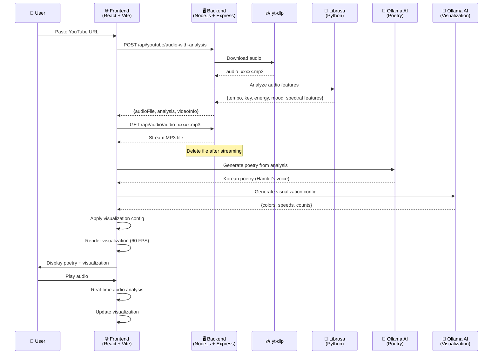
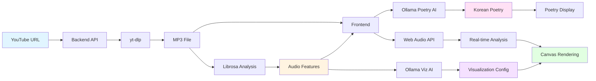

# Music Poetry Canvas

> 🎵 Transform YouTube music into AI-powered poetry and dynamic visualizations
> 
> **Built with [Kiro](https://kiro.dev)** - An AI-powered IDE for rapid development

An immersive web application that transforms YouTube music into a multi-sensory experience by combining real-time audio visualization, AI-generated Korean poetry (in the voice of Hamlet), and dynamic visual effects.

[한국어 문서](README.ko.md)

## ✨ Features

### 🎨 Modern UI Design
- **Dark Theme**: Elegant dark charcoal gray gradient background
- **Burgundy Accents**: Professional burgundy (#800020) header and footer
- **Glassmorphism**: Frosted glass effect cards with backdrop blur
- **shadcn/ui Components**: Polished, accessible UI components

### 🎵 YouTube Audio Integration
- Paste any YouTube URL to instantly analyze and visualize music
- Powered by yt-dlp for reliable audio extraction
- Python librosa for advanced audio feature analysis (tempo, energy, mood, spectral features)

### 🤖 AI-Generated Poetry
- **11 Literary Personas**: Choose from Hamlet, Nietzsche, Yi Sang (이상), Baudelaire, Rimbaud, Kim Soo-young (김수영), Yun Dong-ju (윤동주), Edgar Allan Poe, Oscar Wilde, Kafka, and Baek Seok (백석)
- **7 Languages**: Generate poetry in Korean, English, Japanese, Chinese, French, German, or Spanish
- **Dual AI Providers**: Use local Ollama or cloud-based OpenAI
- **Regenerate Poetry**: Create multiple interpretations of the same music
- Philosophical reflections inspired by music characteristics
- Real-time generation based on audio analysis (~500 characters)

### 🎨 Dynamic Visualizations
- **AI-Configured Parameters**: Visualization settings automatically generated based on music analysis
- **Gradient Mode**: BPM-synchronized rotating gradients with AI-selected colors
- **Equalizer Mode**: Real-time frequency bars with dynamic color schemes
- **Spotlight Mode**: Animated lights with AI-determined count, speed, and radius
- **Combined Mode**: Multiple effects layered together
- YouTube thumbnail backgrounds with gradient overlays

### ⚙️ Customization Settings
- **Settings Panel**: Centralized UI for all AI configuration options
- **Persona Selection**: Choose your preferred literary voice for poetry
- **Language Selection**: Generate poetry in your preferred language
- **AI Provider**: Switch between Ollama (local) and OpenAI (cloud)
- **Model Selection**: Choose from available Ollama models
- **Persistent Settings**: Your preferences are saved across sessions

### 🎭 Storytelling Experience
- Contextual messages during audio analysis
- Smooth transitions between states
- Guidance hints for user interaction
- Experience summary with highlights

### 🔧 Technical Highlights
- Built entirely with **Kiro AI IDE** for rapid development
- Real-time audio analysis with Web Audio API
- Property-based testing with fast-check
- Modular architecture for easy extension

## 🛠️ Tech Stack

### Frontend
- **Framework**: React 18+ with TypeScript
- **Build Tool**: Vite (fast HMR, optimized builds)
- **Styling**: Tailwind CSS v4 with shadcn/ui components
- **UI Components**: shadcn/ui (Button, Input, Card, Slider, Toggle, etc.)
- **State Management**: Zustand (lightweight)
- **Audio Processing**: Web Audio API (native browser support)
- **Visualization**: HTML5 Canvas 2D API
- **Testing**: Vitest + fast-check (property-based testing with 100+ iterations)

### Backend
- **Production**: AWS Lambda + API Gateway (serverless)
  - Poetry Function: Node.js 20.x with AWS Bedrock
  - YouTube Function: Python 3.11 with yt-dlp + librosa
  - Deployed via AWS SAM (Serverless Application Model)
- **Development**: Node.js with Express (local testing)
- **Audio Extraction**: yt-dlp (YouTube audio download)
- **Audio Analysis**: Python librosa (tempo, key, energy, mood, spectral features)
- **CORS**: Configured for both local and production

### AI Integration
- **Local AI**: Ollama (RTX 3060 compatible)
  - Default Model: gemma3:4b
  - Endpoint: http://localhost:11434
  - Supports multiple models (selectable in settings)
- **Cloud AI**: OpenAI API
  - GPT-4, GPT-3.5-turbo, and other models
  - Secure API key storage with encryption
  - Configurable in settings panel
- **Production**: AWS Bedrock (Claude models) - ready for deployment
- **Fallback**: Template-based poetry generation

### Development Tools
- **IDE**: Built with [Kiro](https://kiro.dev) - AI-powered development environment
- **Version Control**: Git
- **Package Manager**: npm

## Project Structure

```
src/
├── components/     # React UI components
├── core/          # Core business logic (managers, controllers)
├── services/      # External service integrations (AI, audio analysis)
├── utils/         # Utility functions
├── types/         # TypeScript type definitions
├── config/        # Configuration files
├── hooks/         # Custom React hooks
└── test/          # Test setup and utilities
```

## 🚀 Getting Started

### Prerequisites

#### For Local Development
- **Node.js 18+** and npm
- **Python 3.8+** with pip (for audio analysis)
- **yt-dlp** (for YouTube audio extraction)
- **Ollama** (for local AI poetry generation)
  - Install from: https://ollama.com/download
  - Pull model: `ollama pull gemma3:4b`

#### For Production Deployment (AWS Lambda)
- **AWS Account** with Bedrock access
- **AWS SAM CLI** installed
- **Docker Desktop** (for local Lambda testing)
- **AWS CLI** configured with credentials

### Installation

1. **Clone the repository**
   ```bash
   git clone <repository-url>
   cd music-poetry-canvas
   ```

2. **Install frontend dependencies**
   ```bash
   npm install
   ```

3. **Install backend dependencies**
   ```bash
   cd backend
   npm install
   pip install -r requirements.txt
   ```

4. **Install yt-dlp**
   ```bash
   # Using pip
   pip install yt-dlp
   
   # Or using your package manager
   # macOS: brew install yt-dlp
   # Windows: winget install yt-dlp
   ```

5. **Configure environment variables**
   ```bash
   # Frontend
   cp .env.example .env.development
   
   # Backend
   cd backend
   cp .env.example .env
   ```

6. **Start Ollama** (if not already running)
   ```bash
   ollama serve
   ```

### Running the Application

#### Local Development

1. **Start the backend server** (in `backend/` directory)
   ```bash
   npm start
   ```
   Backend runs on http://localhost:3001

2. **Start the frontend** (in root directory)
   ```bash
   npm run dev
   ```
   Frontend runs on http://localhost:5173

3. **Open your browser** and navigate to http://localhost:5173

4. **Configure AI Settings** (optional)
   - Click the settings icon in the header
   - Choose your preferred persona and language
   - Select AI provider (Ollama or OpenAI)
   - If using OpenAI, enter your API key

5. **Paste a YouTube URL** and press Enter to start the experience!

#### Production Deployment (AWS Lambda)

See [Lambda Deployment Guide](lambda/README.md) for detailed instructions.

**Quick Start:**
```bash
cd lambda
sam build
sam deploy --guided
```

**Update Frontend:**
```bash
# Update .env.production with your API Gateway URL
VITE_API_ENDPOINT=https://your-api-id.execute-api.region.amazonaws.com/Prod
```

**Deploy Frontend:**
```bash
npm run build
# Deploy dist/ folder to your hosting service (Vercel, Netlify, S3, etc.)
```

### Testing

Run tests:
```bash
npm test              # Run all tests once
npm run test:watch    # Run tests in watch mode
npm run test:ui       # Open Vitest UI
npm run test:coverage # Generate coverage report
```

### Building

Build for production:
```bash
npm run build
```

Preview production build:
```bash
npm run preview
```

## ⚙️ Configuration

### Audio Settings
- **Maximum duration**: 5 minutes (300 seconds)
- **Sample rate**: 44.1 kHz
- **FFT size**: 2048
- **Target FPS**: 60 FPS for smooth visualizations

### AI Configuration

#### In-App Settings Panel
Access the settings panel by clicking the settings icon in the header. Configure:

**Persona Selection** (Default: Hamlet)
- Choose from 11 literary personas
- Each persona brings unique voice and style
- Available: Hamlet, Nietzsche, Yi Sang, Baudelaire, Rimbaud, Kim Soo-young, Yun Dong-ju, Edgar Allan Poe, Oscar Wilde, Kafka, Baek Seok

**Language Selection** (Default: Korean)
- Generate poetry in 7 languages
- Available: Korean (한국어), English, Japanese (日本語), Chinese (中文), French (Français), German (Deutsch), Spanish (Español)

**AI Provider Selection**
- **Ollama (Local)**: Free, private, requires local setup
- **OpenAI (Cloud)**: Requires API key, no local resources needed

#### Ollama (Local Development)
```env
AI_PROVIDER=ollama
OLLAMA_ENDPOINT=http://localhost:11434
OLLAMA_MODEL=gemma3:4b
```
- **Requirements**: RTX 3060 or better with 12GB+ VRAM
- **Model Selection**: Choose from installed models in settings
- **Poetry length**: ~500 characters
- **Temperature**: 0.7 for creative output
- **Setup**: Install Ollama and pull models (e.g., `ollama pull gemma3:4b`)

#### OpenAI (Cloud)
**Setup Instructions:**
1. Get an API key from [OpenAI Platform](https://platform.openai.com/api-keys)
2. Open the settings panel in the app
3. Select "OpenAI" as the AI provider
4. Enter your API key in the secure input field
5. Click "Save" to store (encrypted in browser localStorage)

**Security:**
- API keys are encrypted before storage
- Keys are never logged or exposed
- Stored locally in your browser only

**Models:**
- GPT-4, GPT-3.5-turbo, and other OpenAI models
- Model selection available in settings

**Pricing:**
- Pay-per-use based on OpenAI pricing
- Typical poetry generation: ~$0.001-0.01 per request

#### AWS Bedrock (Production Ready)
```env
AI_PROVIDER=bedrock
AWS_REGION=us-east-1
AWS_BEDROCK_MODEL_ID=anthropic.claude-3-haiku-20240307-v1:0
```
- **Requirements**: AWS credentials configured
- **Model**: Claude 3 Haiku (fast, cost-effective)

### Visualization Configuration
- **Gradient speed**: 0.5-2.0x (AI-configured based on tempo)
- **Equalizer bars**: 32-128 (AI-configured based on complexity)
- **Spotlight count**: 3-8 (AI-configured based on energy)
- **Colors**: Dynamically generated by AI based on mood and valence

## 📁 Project Structure

```
music-poetry-canvas/
├── src/
│   ├── components/          # React UI components
│   │   ├── AudioInput.tsx   # YouTube URL input
│   │   ├── VisualizationCanvas.tsx
│   │   ├── PoetryDisplay.tsx
│   │   └── MusicInfo.tsx    # Track information display
│   ├── core/               # Core business logic
│   │   ├── VisualizationEngine.ts
│   │   └── visualizations/ # Visualization modes
│   ├── services/           # External integrations
│   │   ├── PoetryGenerator.ts
│   │   ├── VisualizationConfigGenerator.ts
│   │   └── OllamaProvider.ts
│   ├── hooks/              # Custom React hooks
│   ├── types/              # TypeScript definitions
│   └── config/             # Configuration
├── backend/
│   ├── server.js           # Express server
│   ├── audio_analyzer.py   # Librosa audio analysis
│   └── requirements.txt    # Python dependencies
└── .kiro/                  # Kiro IDE configuration
    ├── specs/              # Feature specifications
    └── steering/           # Development guidelines
```

## 🎯 How It Works

1. **Configure Settings** (optional): Choose persona, language, and AI provider
2. **Paste YouTube URL**: Enter any YouTube music URL
3. **Audio Analysis**: Backend downloads audio and analyzes with librosa
   - Extracts: tempo, key, energy, valence, mood, spectral features
4. **AI Poetry Generation**: AI generates poetry in your selected persona's voice and language
   - Philosophical reflections based on music characteristics
   - Uses Ollama (local) or OpenAI (cloud) based on your settings
5. **Visualization Configuration**: AI generates visualization parameters
   - Colors, speeds, counts based on music mood and energy
6. **Real-time Rendering**: Web Audio API + Canvas for 60 FPS visualization
7. **Interactive Experience**: Play, pause, switch visualization modes, regenerate poetry

## 🏗️ System Architecture



### Data Flow



## 🎨 Visualization Modes

- **Gradient**: Rotating two-tone gradients synchronized with BPM
- **Equalizer**: Real-time frequency bars with color gradients
- **Spotlight**: Animated lights moving across the background
- **Combined**: All effects layered together

All parameters (colors, speeds, counts) are dynamically generated by AI based on the music's characteristics!

## 🔄 Poetry Regeneration

Don't like the first poem? Click the **Regenerate** button to create a new interpretation:
- Uses the same audio analysis data
- Generates fresh poetry with your selected persona and language
- Maintains poem history for comparison
- Instant regeneration with loading indicator

## 🧪 Testing

```bash
npm test              # Run all tests once
npm run test:watch    # Run tests in watch mode
npm run test:ui       # Open Vitest UI
npm run test:coverage # Generate coverage report
```

**Property-based testing** with fast-check ensures robustness:
- 100+ iterations per property test
- Validates duration boundaries, audio features, visualization parameters

## 🔧 Troubleshooting

### Ollama Issues
- **"Cannot connect to Ollama"**: Ensure Ollama is running (`ollama serve`)
- **No models available**: Pull a model first (`ollama pull gemma3:4b`)
- **Slow generation**: Check GPU availability and model size

### OpenAI Issues
- **"Invalid API key"**: Verify key format starts with `sk-`
- **"Authentication failed"**: Check key is active on OpenAI dashboard
- **Rate limits**: OpenAI has usage limits; check your account status

### Settings Not Saving
- **Check browser localStorage**: Ensure it's not disabled
- **Clear cache**: Try clearing browser cache and reconfiguring
- **Incognito mode**: Settings won't persist in private browsing

### Poetry Generation Fails
- **Check AI provider**: Ensure selected provider is available
- **Fallback to templates**: App uses templates if AI fails
- **Network issues**: OpenAI requires internet connection

### AWS Lambda / Serverless Issues

#### Deployment Errors
- **"Bedrock Access Denied"**: Ensure IAM role has `bedrock:InvokeModel` permission
- **"Layer build failed"**: Use Linux/macOS or CI/CD for layer builds (Windows has compatibility issues)
- **"Stack already exists"**: Use `sam deploy` without `--guided` for updates

#### Runtime Errors
- **CORS errors**: Check API Gateway CORS configuration in `template.yaml`
- **Timeout errors**: Increase timeout in `template.yaml` (max 15 minutes)
- **Memory errors**: Increase memory allocation for the function
- **Cold start latency**: First request may take 1-3 seconds; consider provisioned concurrency

#### Cost Monitoring
- **Unexpected charges**: Set up CloudWatch billing alarms
- **High invocation count**: Check for retry loops or excessive polling
- **Bedrock costs**: Monitor token usage in CloudWatch Logs

See [Lambda README](lambda/README.md) for detailed troubleshooting.

## 📚 Documentation

- [Requirements](.kiro/specs/music-poetry-canvas/requirements.md) - Feature specifications
- [Design Document](.kiro/specs/music-poetry-canvas/design.md) - Architecture and design decisions
- [Implementation Tasks](.kiro/specs/music-poetry-canvas/tasks.md) - Development roadmap
- [Project Overview](.kiro/steering/music-poetry-canvas-overview.md) - Guidelines and patterns

## 🤝 Built With Kiro

This project was developed using **[Kiro](https://kiro.dev)**, an AI-powered IDE that accelerates development through:
- Intelligent code generation and refactoring
- Spec-driven development workflow
- Automated testing and documentation
- Real-time collaboration with AI

Kiro enabled rapid iteration on complex features like AI-powered visualization configuration and real-time audio analysis integration.

## 📄 License

MIT

## 🙏 Acknowledgments

- **Kiro AI** for the development environment
- **Ollama** for local AI inference
- **librosa** for audio analysis
- **yt-dlp** for YouTube audio extraction
