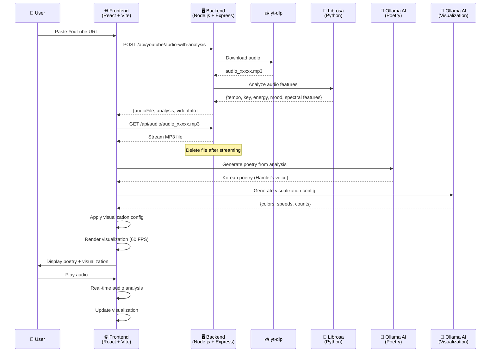
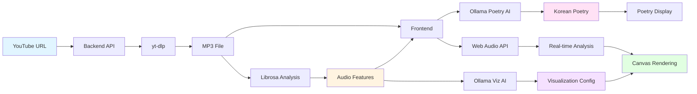

# Music Poetry Canvas

> 🎵 Transform YouTube music into AI-powered poetry and dynamic visualizations
> 
> **Built with [Kiro](https://kiro.dev)** - An AI-powered IDE for rapid development

An immersive web application that transforms YouTube music into a multi-sensory experience by combining real-time audio visualization, AI-generated Korean poetry (in the voice of Hamlet), and dynamic visual effects.

[한국어 문서](README.ko.md)

## ✨ Features

### 🎨 Modern UI Design
- **Dark Theme**: Elegant dark charcoal gray gradient background
- **Burgundy Accents**: Professional burgundy (#800020) header and footer
- **Glassmorphism**: Frosted glass effect cards with backdrop blur
- **shadcn/ui Components**: Polished, accessible UI components

### 🎵 YouTube Audio Integration
- Paste any YouTube URL to instantly analyze and visualize music
- Powered by yt-dlp for reliable audio extraction
- Python librosa for advanced audio feature analysis (tempo, energy, mood, spectral features)

### 🤖 AI-Generated Poetry
- Korean poetry generated in the voice of Shakespeare's Hamlet
- Philosophical reflections inspired by music characteristics
- Powered by Ollama (local) with ~500 character poems
- Real-time generation based on audio analysis

### 🎨 Dynamic Visualizations
- **AI-Configured Parameters**: Visualization settings automatically generated based on music analysis
- **Gradient Mode**: BPM-synchronized rotating gradients with AI-selected colors
- **Equalizer Mode**: Real-time frequency bars with dynamic color schemes
- **Spotlight Mode**: Animated lights with AI-determined count, speed, and radius
- **Combined Mode**: Multiple effects layered together
- YouTube thumbnail backgrounds with gradient overlays

### 🎭 Storytelling Experience
- Contextual messages during audio analysis
- Smooth transitions between states
- Guidance hints for user interaction
- Experience summary with highlights

### 🔧 Technical Highlights
- Built entirely with **Kiro AI IDE** for rapid development
- Real-time audio analysis with Web Audio API
- Property-based testing with fast-check
- Modular architecture for easy extension

## 🛠️ Tech Stack

### Frontend
- **Framework**: React 18+ with TypeScript
- **Build Tool**: Vite (fast HMR, optimized builds)
- **Styling**: Tailwind CSS v4 with shadcn/ui components
- **UI Components**: shadcn/ui (Button, Input, Card, Slider, Toggle, etc.)
- **State Management**: Zustand (lightweight)
- **Audio Processing**: Web Audio API (native browser support)
- **Visualization**: HTML5 Canvas 2D API
- **Testing**: Vitest + fast-check (property-based testing with 100+ iterations)

### Backend
- **Runtime**: Node.js with Express
- **Audio Extraction**: yt-dlp (YouTube audio download)
- **Audio Analysis**: Python librosa (tempo, key, energy, mood, spectral features)
- **CORS**: Configured for local development

### AI Integration
- **Development**: Ollama (local, RTX 3060 compatible)
  - Model: gemma3:4b
  - Endpoint: http://localhost:11434
- **Production**: AWS Bedrock (Claude models) - ready for deployment
- **Fallback**: Template-based poetry generation

### Development Tools
- **IDE**: Built with [Kiro](https://kiro.dev) - AI-powered development environment
- **Version Control**: Git
- **Package Manager**: npm

## Project Structure

```
src/
├── components/     # React UI components
├── core/          # Core business logic (managers, controllers)
├── services/      # External service integrations (AI, audio analysis)
├── utils/         # Utility functions
├── types/         # TypeScript type definitions
├── config/        # Configuration files
├── hooks/         # Custom React hooks
└── test/          # Test setup and utilities
```

## 🚀 Getting Started

### Prerequisites

- **Node.js 18+** and npm
- **Python 3.8+** with pip (for audio analysis)
- **yt-dlp** (for YouTube audio extraction)
- **Ollama** (for local AI poetry generation)
  - Install from: https://ollama.com/download
  - Pull model: `ollama pull gemma3:4b`

### Installation

1. **Clone the repository**
   ```bash
   git clone <repository-url>
   cd music-poetry-canvas
   ```

2. **Install frontend dependencies**
   ```bash
   npm install
   ```

3. **Install backend dependencies**
   ```bash
   cd backend
   npm install
   pip install -r requirements.txt
   ```

4. **Install yt-dlp**
   ```bash
   # Using pip
   pip install yt-dlp
   
   # Or using your package manager
   # macOS: brew install yt-dlp
   # Windows: winget install yt-dlp
   ```

5. **Configure environment variables**
   ```bash
   # Frontend
   cp .env.example .env.development
   
   # Backend
   cd backend
   cp .env.example .env
   ```

6. **Start Ollama** (if not already running)
   ```bash
   ollama serve
   ```

### Running the Application

1. **Start the backend server** (in `backend/` directory)
   ```bash
   npm start
   ```
   Backend runs on http://localhost:3001

2. **Start the frontend** (in root directory)
   ```bash
   npm run dev
   ```
   Frontend runs on http://localhost:5173

3. **Open your browser** and navigate to http://localhost:5173

4. **Paste a YouTube URL** and press Enter to start the experience!

### Testing

Run tests:
```bash
npm test              # Run all tests once
npm run test:watch    # Run tests in watch mode
npm run test:ui       # Open Vitest UI
npm run test:coverage # Generate coverage report
```

### Building

Build for production:
```bash
npm run build
```

Preview production build:
```bash
npm run preview
```

## ⚙️ Configuration

### Audio Settings
- **Maximum duration**: 5 minutes (300 seconds)
- **Sample rate**: 44.1 kHz
- **FFT size**: 2048
- **Target FPS**: 60 FPS for smooth visualizations

### AI Configuration

#### Ollama (Local Development)
```env
AI_PROVIDER=ollama
OLLAMA_ENDPOINT=http://localhost:11434
OLLAMA_MODEL=gemma3:4b
```
- **Requirements**: RTX 3060 or better with 12GB+ VRAM
- **Poetry length**: ~500 characters in Korean
- **Temperature**: 0.7 for creative output

#### AWS Bedrock (Production Ready)
```env
AI_PROVIDER=bedrock
AWS_REGION=us-east-1
AWS_BEDROCK_MODEL_ID=anthropic.claude-3-haiku-20240307-v1:0
```
- **Requirements**: AWS credentials configured
- **Model**: Claude 3 Haiku (fast, cost-effective)

### Visualization Configuration
- **Gradient speed**: 0.5-2.0x (AI-configured based on tempo)
- **Equalizer bars**: 32-128 (AI-configured based on complexity)
- **Spotlight count**: 3-8 (AI-configured based on energy)
- **Colors**: Dynamically generated by AI based on mood and valence

## 📁 Project Structure

```
music-poetry-canvas/
├── src/
│   ├── components/          # React UI components
│   │   ├── AudioInput.tsx   # YouTube URL input
│   │   ├── VisualizationCanvas.tsx
│   │   ├── PoetryDisplay.tsx
│   │   └── MusicInfo.tsx    # Track information display
│   ├── core/               # Core business logic
│   │   ├── VisualizationEngine.ts
│   │   └── visualizations/ # Visualization modes
│   ├── services/           # External integrations
│   │   ├── PoetryGenerator.ts
│   │   ├── VisualizationConfigGenerator.ts
│   │   └── OllamaProvider.ts
│   ├── hooks/              # Custom React hooks
│   ├── types/              # TypeScript definitions
│   └── config/             # Configuration
├── backend/
│   ├── server.js           # Express server
│   ├── audio_analyzer.py   # Librosa audio analysis
│   └── requirements.txt    # Python dependencies
└── .kiro/                  # Kiro IDE configuration
    ├── specs/              # Feature specifications
    └── steering/           # Development guidelines
```

## 🎯 How It Works

1. **Paste YouTube URL**: Enter any YouTube music URL
2. **Audio Analysis**: Backend downloads audio and analyzes with librosa
   - Extracts: tempo, key, energy, valence, mood, spectral features
3. **AI Poetry Generation**: Ollama generates Korean poetry in Hamlet's voice
   - Philosophical reflections based on music characteristics
4. **Visualization Configuration**: AI generates visualization parameters
   - Colors, speeds, counts based on music mood and energy
5. **Real-time Rendering**: Web Audio API + Canvas for 60 FPS visualization
6. **Interactive Experience**: Play, pause, switch visualization modes

## 🏗️ System Architecture



### Data Flow



## 🎨 Visualization Modes

- **Gradient**: Rotating two-tone gradients synchronized with BPM
- **Equalizer**: Real-time frequency bars with color gradients
- **Spotlight**: Animated lights moving across the background
- **Combined**: All effects layered together

All parameters (colors, speeds, counts) are dynamically generated by AI based on the music's characteristics!

## 🧪 Testing

```bash
npm test              # Run all tests once
npm run test:watch    # Run tests in watch mode
npm run test:ui       # Open Vitest UI
npm run test:coverage # Generate coverage report
```

**Property-based testing** with fast-check ensures robustness:
- 100+ iterations per property test
- Validates duration boundaries, audio features, visualization parameters

## 📚 Documentation

- [Requirements](.kiro/specs/music-poetry-canvas/requirements.md) - Feature specifications
- [Design Document](.kiro/specs/music-poetry-canvas/design.md) - Architecture and design decisions
- [Implementation Tasks](.kiro/specs/music-poetry-canvas/tasks.md) - Development roadmap
- [Project Overview](.kiro/steering/music-poetry-canvas-overview.md) - Guidelines and patterns

## 🤝 Built With Kiro

This project was developed using **[Kiro](https://kiro.dev)**, an AI-powered IDE that accelerates development through:
- Intelligent code generation and refactoring
- Spec-driven development workflow
- Automated testing and documentation
- Real-time collaboration with AI

Kiro enabled rapid iteration on complex features like AI-powered visualization configuration and real-time audio analysis integration.

## 📄 License

MIT

## 🙏 Acknowledgments

- **Kiro AI** for the development environment
- **Ollama** for local AI inference
- **librosa** for audio analysis
- **yt-dlp** for YouTube audio extraction
